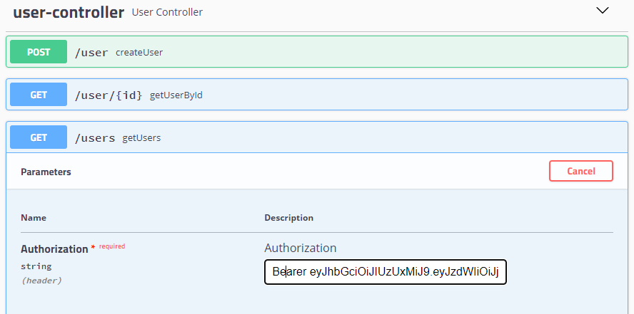
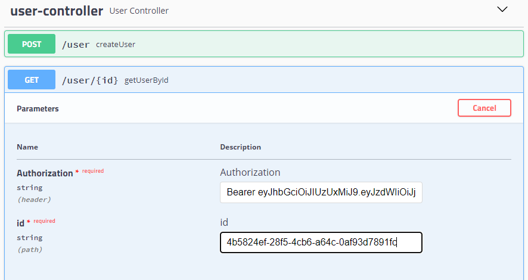

# ms-evaluacionjava

Microservicio que consiste en crear y listar usuarios mediante operaciones protegidas por JWT (Json Web Token)

# Contexto

Una vez que levanta el presente microservicio, se insertan por defecto en BD 3 roles (ADMIN, MANAGER y LEADER), además con el fin de permitir realizar las pruebas posteriores, se inserta por defecto un usuario capaz de solicitar un token (cristopherMunoz) el cual cuenta con roles de ADMIN y MANAGER

A continuacióna se presenta el diagrama de secuencia para la operación de crear usuario. En él se observa que para realizar una operación, primero se debe solicitar un token, y luego realizar la operación.


**Cliente**: Aplicación cliente que requiere crear un usuario

**API**: Interfaz entre las aplicaciones externas y las operaciones del servicio

**RU**: Contiene el registro de los usuarios habilitados para realizar operaciones en la API, contiene además la información respecto de los roles de los usuarios

**BD**: Base de datos de los usuarios con sus números de teléfonos

# Instrucciones de como probar

**Opción 1:** Prueba mediante Postman

1. Descargar e importar la siguiente colección de postman y variables de ambiente local:

[- colección](files/ms-evaluacionjava.postman_collection.json)

[- variable de ambiente localhost](files/localhost.postman_environment.json)


2. Solicitar token de acceso desde la operación **/auth/login**, con el usuario por defecto cristopherMunoz por body como se muestra a continuación:
```yml
{
  "userName": "cristopherMunoz",
  "password": "cmunoz123"
}
```


El servicio anterior entregará el token de acceso para las siguientes operaciones, no es necesario copiarlo, ya que la colección postman está configurada para guardarlo y pegarlo de forma automática para todas las operaciones posteriores.

3. Crear nuevos usuarios desde la operación **/user**, con el formato de ejemplo que se encuentra a continuación:
```yml
{
  {
    "name": "Juan Rodriguez",
    "email": "juan@rodriguez.org",
    "password": "JuanRod123!",
    "phones": [
      {
        "number": "123456789",
        "cityCode": "1",
        "countryCode": "100"
      },
      {
        "number": "987654321",
        "cityCode": "2",
        "countryCode": "200"
      }
    ]
  }
}
```


5. Listar todos los usuarios desde la operación **/users** con el fin de validar y listar los usuarios creados en el punto anterior. Nota: Este servicio no cuenta con parámetros de entrada.


6. Opcionalmente consumir la operación **user/{id}** con el fin de validar y listar un usuario en particular mediante su id, con el formato de ejemplo por url que se muestra a continuación:
```yml
user/4b5824ef-28f5-4cb6-a64c-0af93d7891fc
```


**Opción 2:** Prueba mediante Swagger

1. Acceder a interfaz de Swagger por navegador mediante la siguiente url: http://localhost:8080/swagger-ui.html

2. Solicitar token de acceso desde la operación **/auth/login**, con el usuario por defecto cristopherMunoz por body como se muestra a continuación:
   
3. Copiar el token obtenido en el servicio anterior
4. Pegar el token copiado y crear nuevos usuarios desde la operación **/user**, con el formato de ejemplo que se encuentra a continuación:
```yml
{
  {
    "name": "Juan Rodriguez",
    "email": "juan@rodriguez.org",
    "password": "JuanRod123!",
    "phones": [
      {
        "number": "123456789",
        "cityCode": "1",
        "countryCode": "100"
      },
      {
        "number": "987654321",
        "cityCode": "2",
        "countryCode": "200"
      }
    ]
  }
}
```


5. Pegar el token copiado y listar todos los usuarios desde la operación **/users** con el fin de validar y listar los usuarios creados en el punto anterior. Nota: Este servicio no cuenta con parámetros de entrada.


6. Opcionalmente pegar el token copiado y consumir la operación **user/{id}** con el fin de validar y listar un usuario en particular mediante su id, con el formato de ejemplo por url que se muestra a continuación:



7. **La solución:** Para implementar la solución, se creó un modelo de datos que controla el login de usuario antes de realizar cualquier operación. Mediante este modelo se valida si el usuario que está solicitando un Token está registrado y si cuenta con el rol necesario. A continuación se presenta el modelo relacional para el login:


Luego para el manejo de usuarios y su listado de teléfonos, se creó un modelo de datos donde se tiene una tabla de usuarios, relacionada con una tabla de Teléfonos, como se muestra a continuación:


Para la implementación de la base de datos se utilizó H2, al cual se puede acceder mediante la siguiente url:

http://localhost:8080/h2-console

Datos para el login:

Driver Class: org.h2.Driver

JDBC URL: jdbc:h2:mem:test

User Name: sa

Password: (vacío)

